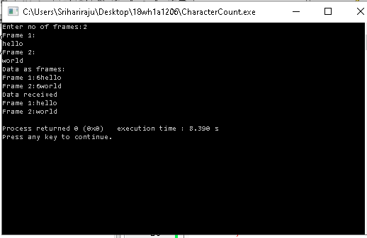

# Experiment 1

## Aim of the Experiment
To impliment data link layer framing techniques such as
i. character count ii. character stuffing and iii.bit stuffing

### step by step procedure of experiment
1.scan the number of frames

2.print data as frames

3.find the string length of each frame

4.print data received

###Output

